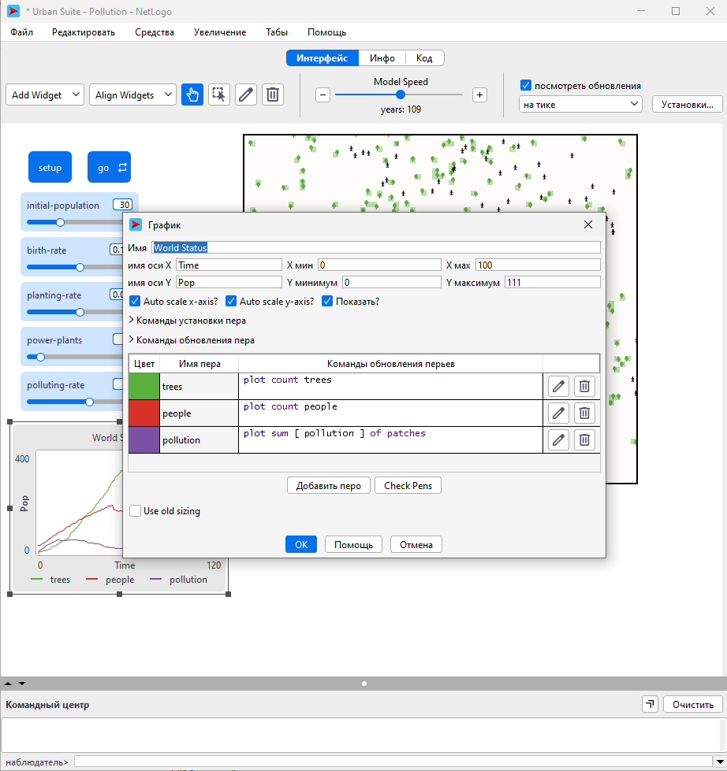
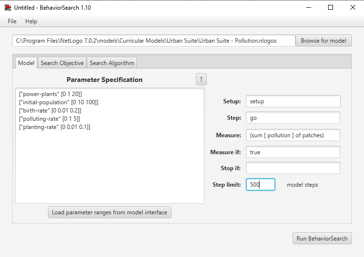
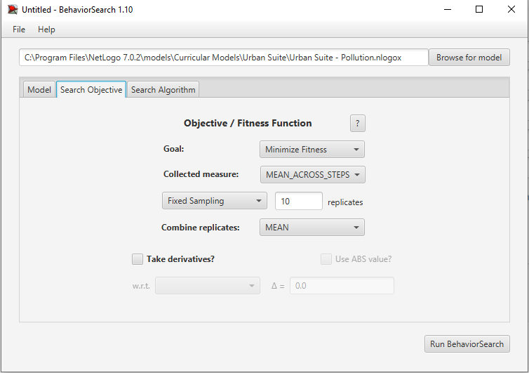
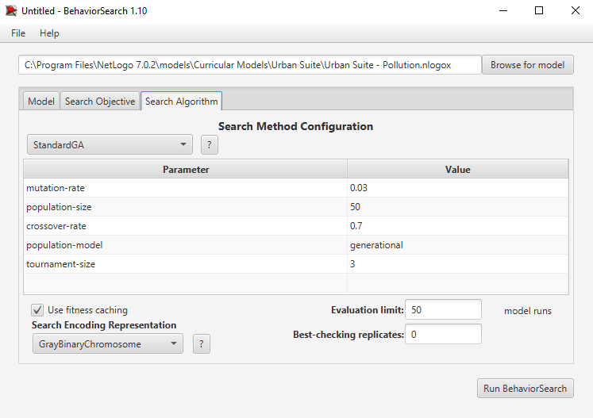

## Комп'ютерні системи імітаційного моделювання
## СПм-24-2, **Бояршинов Євгеній Валентинович**
### Лабораторна робота №**3**. Використання засобів обчислювального інтелекту для оптимізації імітаційних моделей

 

### Варіант 4, модель у середовищі NetLogo:
[Urban Suite - Pollution](https://www.netlogoweb.org/launch#http://www.netlogoweb.org/assets/modelslib/Curricular%20Models/Urban%20Suite/Urban%20Suite%20-%20Pollution.nlogo)

 

### Вербальний опис моделі:
Ця модель симулює крихку рівновагу екосистеми хижак-жертва, демонструючи взаємодію між трьома основними компонентами міської екосистеми:
- Люди (people) — агенти, що пересуваються територією, взаємодіють із забрудненням та можуть народжувати нових агентів.
- Дерева (trees) — агенти стаціонарного типу, що виконують функцію очищення навколишнього середовища.
- Електростанції (power plants) — джерела забруднення, які генерують полютанти у певному радіусі.
Разом вони формують динамічну екосистему, у якій дерева поглинають забруднення, електростанції його виробляють а люди виживають або гинуть залежно від рівня забруднення. Система демонструє коливання та тенденції до рівноваги або деградації.

### Керуючі параметри:
- **initial-population**	визначає початкову кількість людей у моделі.
- **birth-rate**	визначає імовірність народження нових людей.
- **planting-rate**	визначає імовірність появи нових дерев.
- **power-plants**	визначає кількість електростанцій.
- **polluting-rate**	визначає кількість забруднення, що генерується електростанцієй кожен такт.

### Внутрішні параметри:
- **Кількість людей (people)** - кількість агентів що пов'язані із параметром здоров'я (health) та позицією.
- **Кількість дерев (trees)** - кількість агентів що пов'язані із параметром здоров'я (health).
- **Забруднення (pollution)** - середнє або сумарне забруднення.
- **Здоров'я (health)** - загальний параметр для людей та дерев.

### Показники роботи системи:
У моделі Urban Suite — Pollution графік відображає три головні показники, що змінюються кожен такт симуляції:
- чисельність дерев, тобто кількість існуючих на даний момент дерев, що очищують повітря;
- чисельність людей, тобто популяція людей, які вижили при поточному рівні забруднення;
- сумарне забруднення, тобто суму полютантів на всіх патчах, яка визначає екологічний стан системи.

### Правила роботи:
Електростанції – це комірки мережі з дуже високим фіксованим значенням забруднення (визначеним повзунком РІВНЯ ЗАБРУДНЕННЯ).
Усі комірки сітки мають певне значення забруднення, хоча воно може дорівнювати 0. Забруднення поширюється по всій сітці, тому кожна сітка ділить частину свого значення забруднення з сусідніми комірками. Оскільки рівень забруднення на електростанціях фіксований на високому рівні, це призводить до того, що забруднення виходить з електростанцій.
Однак дерева очищають забруднення в комірці, де вони посаджені, та в сусідніх комірках. Таким чином, вони блокують поширення забруднення, випромінюючи низькі значення забруднення. Дерева живуть протягом певного періоду часу та не можуть розмножуватися.
На кожному кроці (такті) моделі люди-агенти:
- випадковим чином перейти до сусідньої клітинки
- з певною ймовірністю вони можуть посадити елемент ландшафту
- якщо вони достатньо здорові, то з певною ймовірністю можуть розмножуватися (клонуватися)
- якщо їхнє здоров'я падає до 0, вони помирають.

 

### Налаштування середовища BehaviorSearch:

**Обрана модель**:
<pre>
C:\Program Files\NetLogo 7.0.2\models\Curricular Models\Urban Suite\Urban Suite - pollution
</pre>
**Параметри моделі** (вкладка Model):  
*Параметри та їх можливі діапазони були **автоматично** вилучені середовищем BehaviorSearch із вибраної імітаційної моделі, для цього є кнопка «Завантажити діапазони параметрів із інтерфейсу моделі»*:
<pre>
["power-plants" [0 1 20]]
["initial-population" [0 10 100]]
["birth-rate" [0 0.01 0.2]]
["polluting-rate" [0 1 5]]
["planting-rate" [0 0.01 0.1]]
</pre>
Використовувана міра:
Для цільової функції обрано показник кількості людей — кількість людей, на кінець моделювання.
Цей показник наявний у графіку стану середовища (World Status) моделі NetLogo:

та вказано у параметрі "**Measure**":
<pre>
count people
</pre>
Цей вираз повертає кількість людей у кінці кожної симуляції.
Далі BehaviorSearch використовує його для побудови цільової функції.

**Налаштування цільової функції** (вкладка Search Objective)
Оскільки метою дослідження є збільшення населення міста, у BehaviorSearch було встановлено:
Goal: Maximize fitness — мінімізувати загальне забруднення.
Collected measure: AT_FINAL_STEPS — значення кількості людей на кінці кожного моделювання.
Measure if: true — враховувати значення на кожному такті.
Такий підхід дозволяє оцінити не разове, а стабільне середнє значення забруднення протягом усієї симуляції.
Загальний вигляд вкладки:

Загальний вид вкладки налаштувань алгоритму пошуку:

